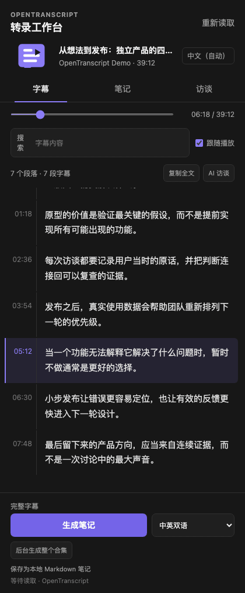

# OpenTranscript

**面向 YouTube 与 Bilibili 的本地优先视频转录工作台。**

在视频旁阅读带时间戳的字幕，留下值得保存的片段，依据字幕追问，并把一个视频或整个 B 站合集整理成自己拥有的 Markdown 笔记。

[English](README.md) · [下载 v0.2.0](https://github.com/cassieliang6709/open-transcript/releases/latest) · [更新记录](CHANGELOG.md)



## 核心流程

**阅读字幕 → 加入摘录 → 生成 AI 笔记 → 后台处理整个合集**

- 搜索完整字幕，跟随播放，并点击时间戳回到原片。
- 选中文字后复制、编辑或加入重点摘录。
- 对当前字幕进行 AI 访谈，生成中文、英文或逐段双语笔记。
- 总结中的关键观点带可点击的时间线引用，点击即可定位播放器。
- 点击“稍后在 Obsidian 看”后即可关闭侧栏；任务落盘保存，服务重启后继续，完成时通过 Chrome 通知打开笔记。
- Bilibili 多 P 视频可以留在本地服务中逐集处理，关闭侧栏后仍会继续。
- 笔记写入本机 Markdown 文件；API Key 只保存在本地服务配置中。

## 三步安装

v0.2.0 支持 Apple Silicon Mac 与 Chrome 系浏览器。

### 1. 安装本地服务

在终端运行：

```sh
/bin/bash -c "$(curl -fsSL https://raw.githubusercontent.com/cassieliang6709/open-transcript/main/scripts/install-macos.sh)"
```

服务会安装到 `~/.local/share/open-transcript`，配置位于 `~/.config/open-transcript/.env`，笔记默认写入 `~/Documents/OpenTranscript`。配置模型后这样重启：

```sh
launchctl kickstart -k "gui/$(id -u)/com.opentranscript.server"
```

### 2. 加载 Chrome 扩展

下载并解压 [`open-transcript-chrome-v0.2.0.zip`](https://github.com/cassieliang6709/open-transcript/releases/download/v0.2.0/open-transcript-chrome-v0.2.0.zip)。打开 `chrome://extensions`，启用**开发者模式**，点击**加载已解压的扩展程序**，选择解压后的文件夹。

### 3. 打开视频

打开带字幕的 YouTube 视频或 `bilibili.com/video/BV...` 页面，点击 OpenTranscript。在**扩展选项**中保留服务地址 `http://127.0.0.1:4242`，点击**测试连接**。

## 配置模型

默认使用本地 Ollama：

```sh
ollama pull qwen2.5:7b
ollama serve
```

也可以在 `~/.config/open-transcript/.env` 中配置 DeepSeek、SiliconFlow、OpenAI、OpenRouter 或其他 OpenAI-compatible 服务：

```dotenv
LLM_PROVIDER=openai
LLM_BASE_URL=https://api.siliconflow.cn/v1
LLM_MODEL=deepseek-ai/DeepSeek-V4-Flash
LLM_API_KEY=your-key-here
```

不要把 API Key 写进扩展目录或提交到 Git。

## 当前能力

| 模块 | 行为 |
| --- | --- |
| 视频来源 | 有可访问字幕轨道的 YouTube 视频与 Bilibili BV 页面 |
| 字幕 | 搜索、播放定位、跟随播放、段落编辑、复制全文 |
| AI 笔记 | 摘要与长文；支持中文、英文和沉浸式双语 |
| 时间线引用 | 总结关键观点引用 `[MM:SS]`，侧栏与导出的 Markdown 都可跳回原片 |
| 视频收件箱 | 当前视频一键入队；任务重启恢复；完成通知可直接在 Obsidian 打开 |
| 后台合集 | 最多 100 个 B 站分 P；顺序处理、跳过已有、单项失败继续、可取消 |
| 本地存储 | 按来源和语言去重的 Markdown 文件 |
| 模型 | Ollama 原生接口或 OpenAI-compatible Chat Completions 接口 |

OpenTranscript 当前读取平台已有字幕。没有可用字幕的视频会显示明确错误，不会在用户不知情时上传媒体。语音识别兜底在后续规划中。

## 从源码运行

```sh
git clone https://github.com/cassieliang6709/open-transcript.git
cd open-transcript
cp .env.example .env
cargo test
cargo run --release
```

开发时在 `chrome://extensions` 加载 `extension/`。构建发布包：

```sh
./scripts/package-extension.sh
./scripts/package-macos-backend.sh
```

健康检查：`curl http://127.0.0.1:4242/health`。

## 路线图

- 无字幕视频的语音识别兜底
- YouTube 播放列表后台处理
- 扩展内模型配置
- 本地视频与笔记资料库
- 签名安装包与 Chrome Web Store 发布

## License

[MIT](LICENSE)
